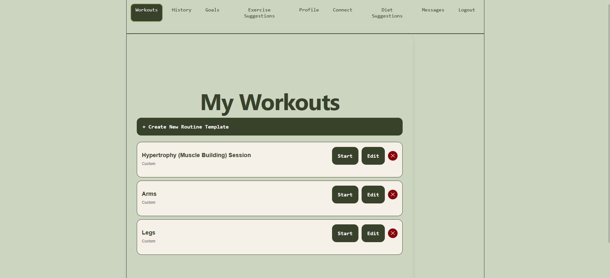
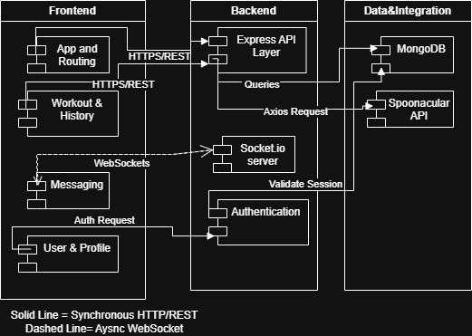
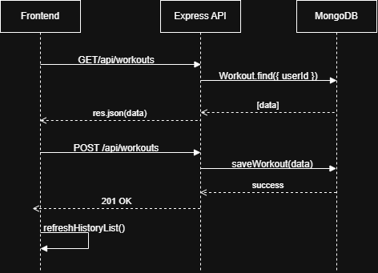
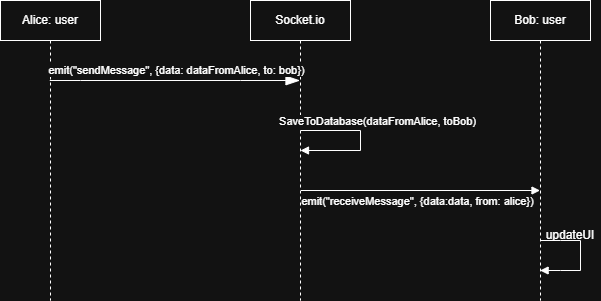

# Fitness-Tracker
Fitness-Tracker is an app that allows you to track information about your fitness, including planning workouts, diet, and connecting with your friends! The primary feature of Fitness-Tracker is being able to create, edit, and start workouts. You can also set your goals to receive personalized suggestions for workouts that will help you reach your goals. Based on your goals, you can also receive diet suggestions. Fitness-Tracker also helps you connect with your friends over fitness, allowing you to send messages and workouts to your friends!

<p align="center">  
*Screenshot from the Fitness-Tracker App*</p>

## Authors

* Forrest Allen (flallen06@ucla.edu)
* Riya Patil (rpatil1@ucla.edu)
* Owen Rusk (owenrusk@ucla.edu)
* Ashley Torres (at4633112@ucla.edu)
* Johnny Zhang (jzhang566@ucla.edu)

## Features

### Workouts

Users can create named custom workouts where they can specify the order of different exercises which includes the name, weight, reps, and/or time of the workout. The workouts can be edited to change the workout. Users can start a workout and then log it to their history.

### History

Fitness-Tracker stores the history of your previous workouts. You can search by workout name or exercise name to track your progress.

### Goals and Targets

You can pick from a variety of goals to shape your workouts. You can decide when goals are completed or remove them without completing them.

Targets track your progress toward a measurable outcome, such as weight, number of workouts, and duration of an exercise.

### Exercise Suggestions

Based on your goal(s), Fitness-Tracker will give you personalized suggestions to help you achieve your goal(s).

### Profile

Your profile stores information about you which can be shared to other users. This information includes, name age, weight, height, dietary restrictions, fitness goal, activity level, and your bio.

### Connect with Others

You can find and connect with other users on the site. You can send and receive connections requests, which will allow you to view a user's profile and send/receive messages after connecting with them. You can also send/receive workouts with your connections.

### Diet Suggestions

Based on your goal(s), you can receive suggestions on what meals you can eat. This includes information about calories, protein, carbs, and fat. Each meal suggestion includes a link to a recipe.

## Implementation Description

<p align="center">  
*Our architecture includes a frontend, backend, and external sources. The diagram shows how they interface with each other*</p>

<p align="center">  
<p align="center">*This is an example of how the workouts are saved and shown to users*</p>


<p align="center">*This example displays how a user can send messages to another user which is then received*</p>

## Installation

### Dependencies

* [Node.js](https://nodejs.org/en/download) version 26.1 or later
* [MongoDB Server](https://www.mongodb.com/) (local or Atlas)

### Setup

1. Clone the repository:
    ```bash
    git clone https://github.com/AstroPancake72/Fitness-Tracker.git
    ```

2. Enter the project directory:
    ```bash
    cd Fitness-Tracker
    ```

### Backend

3. Enter the backend directory:
    ```bash
    cd backend
    ```

4. Create a `.env` file in the `backend` folder (see .env.example) with the following variables:

    ```env
    MONGO_URI=your_mongodb_connection_string
    EMAIL_USER=your_email_address
    EMAIL_PASS=your_email_app_specific_password
    SESSION_SECRET=your_random_secret_session_id
    RAPIDAPI_KEY=your_rapidapi_api_key
    SPOONACULAR_API_KEY=your_spoonacular_api_key
    ```

5. Install node.js dependencies:
    ```bash
    npm install
    ```

6. Start the backend server:
    ```bash
    npm start
    ```

### Frontend

6. Create another terminal in the project directory

7. Enter the frontend directory:
    ```bash
    cd frontend
    ```

8. Install node.js dependencies:
    ```bash
    npm install
    ```

9. Start the frontend server:
    ```bash
    npm run dev
    ```

10. Open your browser to the provided Vite URL
